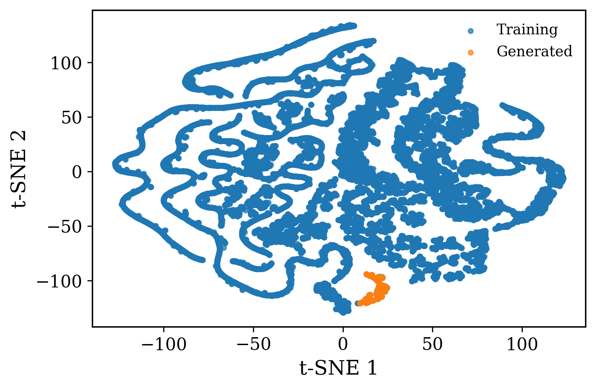

# HeatGen
### This repo is the implementation of the original HeatGen paper: https://arxiv.org/abs/2511.09578

#### This paper is a condensed version of our Geometric and Generative Foundation Models framework, which is used for physics prediction and hardware design automation in electronics cooling. The code will be released upon acceptance of the paper.

* Workflow of the HeatGen model that generates optimized heat sink designs

* Optimized 3D heat sink 1

* Optimized 3D heat sink 2

* t-SNE of the guided diffusion model

